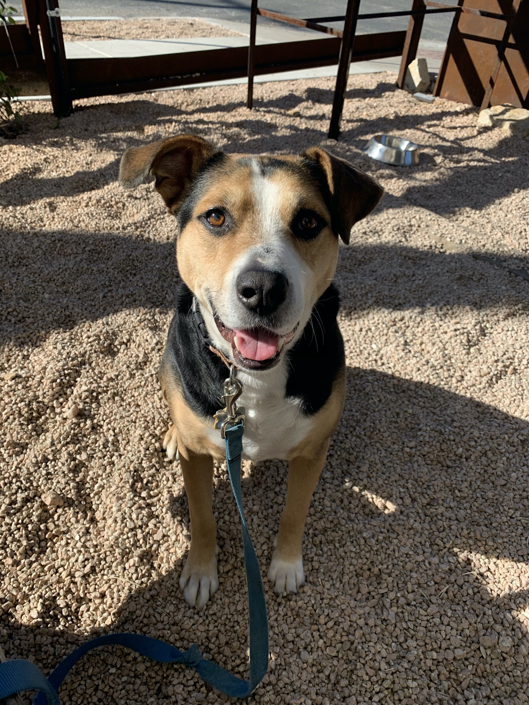

## Questions
1. Which dog breeds are the most popular? Has this changed over the past several years?
2. What attributes are most important for predicting dog breed rankings?
3. How do the top 5 dog breeds score on those key attributes?

Data obtained from [https://github.com/rfordatascience/tidytuesday/tree/master/data/2022/2022-02-01](TidyTuesday repository on Github.)

Thomas Mock (2022). Tidy Tuesday: A weekly data project aimed at the R ecosystem. https://github.com/rfordatascience/tidytuesday.

```{r setup, include=FALSE, echo=FALSE}
knitr::opts_chunk$set(echo = FALSE, warning=FALSE, message=FALSE)

setwd(getwd())

library(tidyverse)
library(randomForest)
library(ggimage)
library(plotly)
library(magick)
library(knitr)

breed_traits <- readr::read_csv('https://raw.githubusercontent.com/rfordatascience/tidytuesday/master/data/2022/2022-02-01/breed_traits.csv')
trait_description <- readr::read_csv('https://raw.githubusercontent.com/rfordatascience/tidytuesday/master/data/2022/2022-02-01/trait_description.csv')
breed_rank_all <- readr::read_csv('https://raw.githubusercontent.com/rfordatascience/tidytuesday/master/data/2022/2022-02-01/breed_rank.csv')

# breed_rank_all$BreedID <- substr(breed_rank_all$Breed, 1, 6)
# breed_traits$BreedID <- substr(breed_traits$Breed, 1, 5)

pdf_names <- paste0("img/", breed_rank_all$Breed, ".jpg")
# safe_download <- safely(~ download.file(.x , .y))
# walk2(breed_rank_all$Image, pdf_names, safe_download)
# 
# 
# for (i in sort(pdf_names)){
#   img1 <- image_read(i, 'bw')
#   img_new <- image_transparent(image_median(image_contrast(img1), radius=3), 'white')
#   image_write(img_new, path = paste0(substr(i, 1, nchar(i)-4), '_new.png'), format = "png")
#   
# }

breed_rank_all <- breed_rank_all %>%
  arrange(Breed) %>%
  mutate(LocalImage = list.files(path='img', pattern='*_new.png', full.names = TRUE))

breed_rank_all %>%
  select(Breed, LocalImage)

colnames(breed_rank_all) <- make.names(colnames(breed_rank_all), unique=TRUE)

df <- merge(breed_rank_all, breed_traits, by='Breed')
colnames(df) <- make.names(colnames(df), unique=TRUE)

df <- df %>%
  mutate(across(where(is.numeric), as.integer))

```

### Quick snapshot

```{r}
kable(head(df))
```

Any missing values?

```{r fig.width = 7}

missing.values <- df %>%
  gather(key = "key", value = "val") %>%
  mutate(isna = is.na(val)) %>%
  group_by(key) %>%
  mutate(total = n()) %>%
  group_by(key, total, isna) %>%
  summarise(num.isna = n()) %>%
  mutate(pct = num.isna / total * 100)

levels <-
    (missing.values  %>% filter(isna == T) %>% arrange(desc(pct)))$key

percentage.plot <- missing.values %>%
      ggplot() +
        geom_bar(aes(x = reorder(key, desc(pct)), 
                     y = pct, fill=isna), 
                 stat = 'identity', alpha=0.8) +
      scale_x_discrete(limits = levels) +
      scale_fill_manual(name = "", 
                        values = c('steelblue', 'tomato3'), labels = c("Present", "Missing")) +
      coord_flip() +
      labs(title = "Percentage of missing values", x =
             'Variable', y = "% of missing values")

percentage.plot

```


## Which dog breeds were the favorite in 2020?

```{r}

n_topdogs <- 10

breed_rank_all %>%
  slice_min(order_by = X2020.Rank, n = n_topdogs) %>%
  mutate(Place = as.integer(order(order(X2020.Rank, decreasing=FALSE), decreasing=FALSE))) %>%
  mutate(Order = as.integer(order(Place, decreasing=TRUE))) %>%
  select(X2020.Rank, Place, Order, Breed, LocalImage) %>%
  ggplot(aes(x=Place, y=Order, group=Breed, fill=Breed, label=Breed)) +
  geom_col() + 
  geom_image(aes(image=LocalImage), size=.12) + geom_text(aes(label = Breed), nudge_y = -1, size=2) +
  theme_minimal() + theme(axis.text.x = element_text(angle = 45, vjust = .5, hjust=1)) +
  scale_fill_brewer(palette="Set3") + ylim(0, n_topdogs+1) + ggtitle("Top Dogs in 2020") + 
  theme(axis.text.y = element_blank()) + scale_x_continuous("Place on the Podium", breaks=seq(1,n_topdogs), labels = as.character(seq(1, n_topdogs))) + ylab("") + theme(axis.text.x = element_text(angle = 0))

ggsave('topdogs.png', dpi=300)

```


## Which dog breeds are the favorites over the years?

Let's look at the top 10 dog breeds since 2013.

```{r fig.height=11,fig.width = 20}

breed_rank_all %>%
  pivot_longer(contains("Rank"), names_to = "Year", values_to = "Rank") %>%
  mutate(Year = substr(Year, 2, 5)) %>%
  # filter(Year > 2017) %>%
  group_by(Year) %>%
  slice_min(order_by = Rank, n = n_topdogs) %>%
  mutate(Place = order(order(Rank, decreasing=FALSE), decreasing=FALSE)) %>%
  mutate(Order = order(Place, decreasing=TRUE)) %>%
  select(Year, Rank, Place, Order, Breed, LocalImage) %>%
  ggplot(aes(x=Place, y=Order, group=Breed, fill=Breed, label=Breed)) +
  geom_col() + facet_wrap(~ Year, scales = "free_x", nrow=2) +
  geom_image(aes(image=LocalImage), size=.12) + geom_text(aes(label = Breed), nudge_y = -.5) +
  theme_classic() + theme(axis.text.x = element_text(angle = 45, vjust = 0.5, hjust=1)) +
  scale_fill_brewer(palette="Set3") + ylim(0, n_topdogs+1) +
  theme(axis.text.y = element_blank()) + scale_x_continuous("Place on the Podium", breaks=seq(1,n_topdogs), labels = as.character(seq(1, n_topdogs))) + ylab("") + theme(axis.text.x = element_text(angle = 0))
  
```

```{r}

topBreeds <- breed_rank_all %>%
  pivot_longer(contains("Rank"), names_to = "Year", values_to = "Rank") %>%
  mutate(Year = substr(Year, 2, 5)) %>%
  # filter(Year > 2017) %>%
  group_by(Year) %>%
  slice_min(order_by = Rank, n = n_topdogs) %>%
  select(Breed) %>%
  .$Breed
  
breed_rank_all %>%
  filter(Breed %in% topBreeds) %>%
  pivot_longer(contains("Rank"), names_to = "Year", values_to = "Rank") %>%
  mutate(Year = substr(Year, 2, 5)) %>%
  ggplot(aes(x=Year, y=Rank, group=Breed)) +
  geom_line(aes(color=Breed, linetype=Breed)) + 
  geom_image(aes(image=LocalImage), size=.08) + 
  theme_classic() + 
  scale_fill_brewer(palette="Set3") +
  scale_y_reverse() + theme(axis.text.y = element_blank())

ggsave("topdogs_year.png", dpi=300)

```

Ok, maybe we should look at another graph without the cute pictures?

```{r}
breed_rank_all %>%
  filter(Breed %in% topBreeds) %>%
  pivot_longer(contains("Rank"), names_to = "Year", values_to = "Rank") %>%
  mutate(Year = substr(Year, 2, 5)) %>%
  ggplot(aes(x=Year, y=Rank, group=Breed)) +
  geom_line(aes(color=Breed, linetype=Breed)) + 
  theme_classic() + 
  scale_fill_brewer(palette="Set3") +
  scale_y_reverse() + theme(axis.text.y = element_blank())


```

Wow, what a comeback for the Pembroke Welsh Corgis!


## What about the underdogs?


```{r}
underDogs <- breed_rank_all %>%
  pivot_longer(contains("Rank"), names_to = "Year", values_to = "Rank") %>%
  mutate(Year = substr(Year, 2, 5)) %>%
  group_by(Year) %>%
  slice_max(order_by = Rank, n = n_topdogs) %>%
  select(Breed) %>%
  .$Breed

breed_rank_all %>%
  filter(Breed %in% underDogs) %>%
  pivot_longer(contains("Rank"), names_to = "Year", values_to = "Rank") %>%
  mutate(Year = substr(Year, 2, 5)) %>%
  ggplot(aes(x=Year, y=Rank, group=Breed)) +
  geom_line(aes(color=Breed, linetype=Breed)) + 
  geom_image(aes(image=LocalImage), size=.08) + 
  theme_classic() + 
  scale_fill_brewer(palette="Set3") +
  scale_y_reverse() + theme(axis.text.y = element_blank())

ggsave('underdogs.png', dpi=300)

```


```{r}

breed_rank_all %>%
  filter(Breed %in% underDogs) %>%
  pivot_longer(contains("Rank"), names_to = "Year", values_to = "Rank") %>%
  mutate(Year = substr(Year, 2, 5)) %>%
  ggplot(aes(x=Year, y=Rank, group=Breed)) +
  geom_line(aes(color=Breed, linetype=Breed)) + 
  theme_classic() + 
  scale_fill_brewer(palette="Set3") +
  scale_y_reverse() + theme(axis.text.y = element_blank())

```

```{r}
unique(df$Breed)
```


## What are the most important traits for predicting the overall ranking in 2020?

Work in progress - still figuring out the merge :)

Using random forest, we can see how important the different traits are for the 2020 ranking.

```{r, echo=TRUE}
rf1 <- randomForest(X2020.Rank ~ . , data = select(df, -colnames(df)[grepl("X201[0-9].Rank", colnames(df))], -LocalImage, -Image, -links, -Breed), importance=TRUE) # fit the random forest with default parameter
```

Let's take a look at the importance, evaluated using the percent increase in MSE (higher is more important).

```{r}
imp <- as.data.frame(importance(rf1,type=1, scale=TRUE))
imp <- rownames_to_column(imp)
colnames(imp) <- c('Attribute', 'Importance')

plotVars <- imp %>%
  mutate_at(vars(Importance), as.numeric) %>%
  arrange(desc(Importance)) %>%
  top_n(Importance, 5) %>%
  select(Attribute) %>%
  .$Attribute

p0 <- imp %>%
  mutate_at(vars(Importance), as.numeric) %>%
  arrange(desc(Importance)) %>%
  top_n(Importance, 5) %>%
  ggplot(aes(x=Attribute, y=Importance, fill=Attribute)) +
  geom_col() + theme_classic() + scale_fill_brewer(palette='Set2') +
  theme(axis.text.x = element_text(angle = 20, hjust=1)) + ylab('% Increase MSE') 

ggplotly(p0)
```


## What do these scores mean? 

We can check out the trait description table to see how each of these measures was coded. I wish I could take these survey! Look at those value assignments for upper and lower bounds!

```{r echo=FALSE}
trait_description$traitID <- make.names(trait_description$Trait)
kable(trait_description %>% filter(traitID %in% plotVars) %>% select(-traitID))

```


## How did the top dog breeds score on these key traits?

Using a boxplot to see the difference in distributions across traits between the top 25% (alphas) of dogs according to the 2020 ranking tend to score compared to the other 75% (betas?)

Disclaimer: All dogs are alpha to me, except for my dog, who is the super alpha.

```{r}
p2 <- df %>%
  select(X2020.Rank, plotVars) %>%
  mutate(RankGroup = ifelse(X2020.Rank <= quantile(df$X2020.Rank, probs=.25),"Alpha", "Beta")) %>%
  mutate(across(where(is.numeric), as.character)) %>%
  pivot_longer(plotVars, names_to='Attribute', values_to='Score') %>%
  ggplot(aes(x=RankGroup, y=Score, group=RankGroup, fill=RankGroup)) +
  geom_boxplot() + 
  facet_wrap(~ Attribute, scales='free') + 
  scale_fill_brewer(palette='Set2') +
  theme_minimal()

ggplotly(p2)

```


## How do tippy top dogs score on the most important traits?

Bringing this back around to the favorite top 10
```{r}
p <- df %>%
  pivot_longer(contains("Rank"), names_to = "Year", values_to = "Rank") %>%
  mutate(Year = substr(Year, 2, 5)) %>%
  filter(Year > 2017) %>%
  group_by(Year) %>%
  slice_min(order_by = Rank, n = n_topdogs) %>%
  select(Year, Breed, LocalImage, plotVars) %>%
  mutate(across(where(is.numeric), as.character)) %>%
  pivot_longer(plotVars, names_to='Attribute', values_to='Score') %>%
  ggplot(aes(x=Score, fill=Breed)) +
  geom_histogram(stat="count") + facet_wrap(~ Attribute, scales = "free_x") +
  theme_void() + 
  scale_fill_brewer(palette="Set2") + ylab("Count")

ggplotly(p)

```

## My favorite dog?




